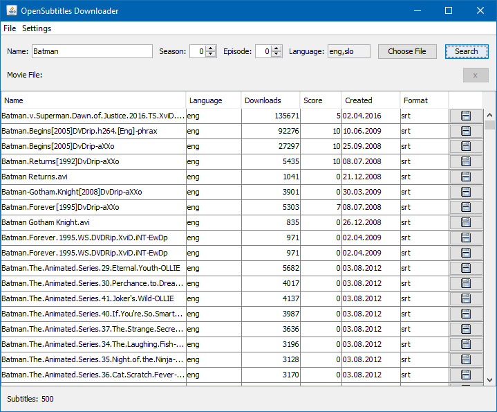
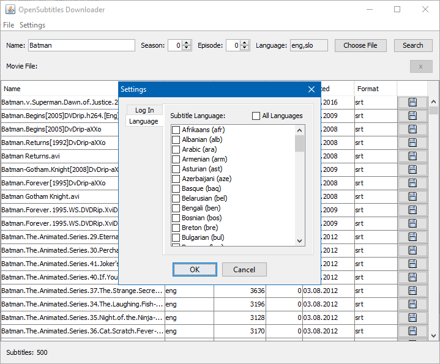

# subs
Small Java application for downloading subtitles from [OpenSubtitles.org](http://www.opensubtitles.org/).

Uses official OpenSubtitles.org XMLRPC API, you can see API documentation [here](https://trac.opensubtitles.org/projects%3Cscript%20type=/opensubtitles/wiki/XMLRPC0").

### Features:
- searching subtitles by name of movie/series
- searching subtitles by movie file
- settings for preffered languages
- settings for user account

### Requirements:
- Java JDK 8 or higher

### Screenshots:

Project was developed in April 2016 as an assignment for course Java - development of applications at [University of Zilina - Faculty of Management Science and Informatics](http://www.fri.uniza.sk/).
