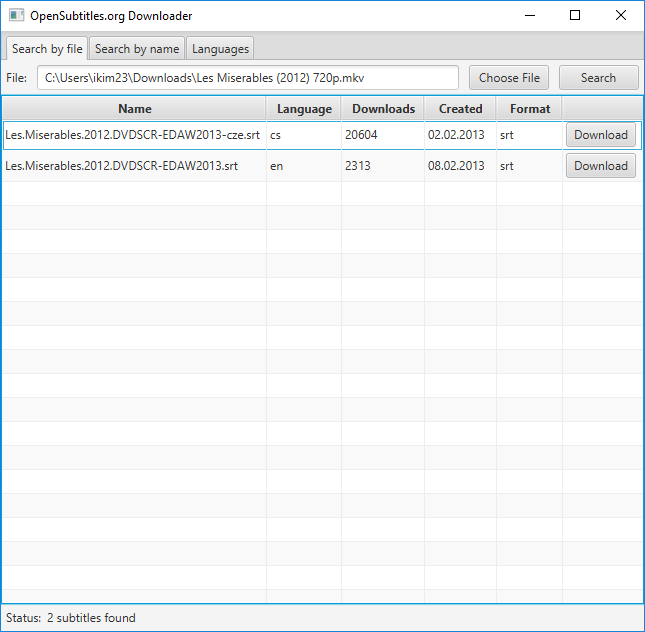

# Subs2

Older version developed in Java is [here](https://github.com/ikim23/Subs).

Small Java application for downloading subtitles from [OpenSubtitles.org](http://www.opensubtitles.org/).

Uses official OpenSubtitles.org XMLRPC API, you can see API documentation [here](https://trac.opensubtitles.org/projects%3Cscript%20type=/opensubtitles/wiki/XMLRPC0").

### Screenshots:

